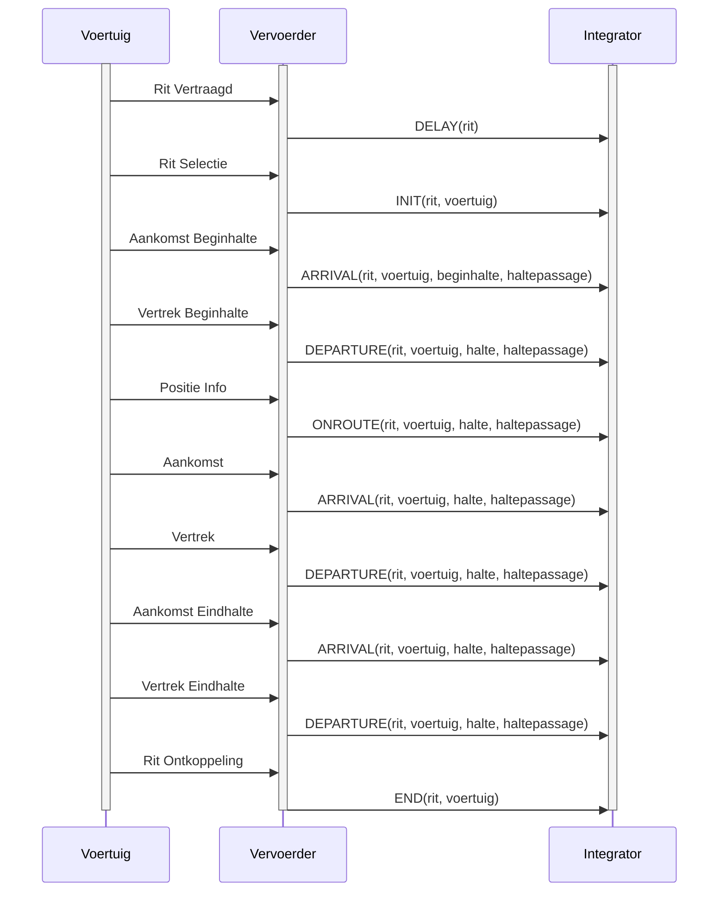

# BISON TMI8 Specification Implementation

This document outlines the implementation of BISON TMI8 specification message handling in the Live OV Info application.

## Message Flow Sequence

Based on the BISON TMI8 specification, the typical message flow for a bus journey is:



## KV6 Message Types

### Journey State Messages

| Message Type | Dutch Name | Description | Terminal Color |
|--------------|------------|-------------|----------------|
| `INIT` | Rit Selectie | Journey initialization/start | Cyan |
| `DELAY` | Rit Vertraagd | Journey delayed | Bold Red |
| `END` | Rit Ontkoppeling | Journey termination/end | Magenta |
| `CANCEL` | Rit Geannuleerd | Journey cancelled | Bold Red |

### Stop-Related Messages

| Message Type | Dutch Name | Description | Terminal Color |
|--------------|------------|-------------|----------------|
| `ARRIVAL` | Aankomst | Arrival at stop | Green |
| `DEPARTURE` | Vertrek | Departure from stop | Red |
| `ONSTOP` | Op halte | Stationary at stop | Yellow |

### Route Messages

| Message Type | Dutch Name | Description | Terminal Color |
|--------------|------------|-------------|----------------|
| `ONROUTE` | Positie Info | Position update while en route | Blue |
| `OFFROUTE` | Van route af | Vehicle off route | Bold Yellow |

## Implementation

### Parser (src/data/parser.py)

The parser handles all BISON TMI8 message types:

```python
known_types = [
    'ARRIVAL',    # Aankomst (halte)
    'DEPARTURE',  # Vertrek (halte)
    'ONROUTE',    # Positie Info (onderweg)
    'ONSTOP',     # Op halte (stil)
    'INIT',       # Rit Selectie/Start
    'END',        # Rit Ontkoppeling/Einde
    'DELAY',      # Rit Vertraagd
    'OFFROUTE',   # Van route af
    'CANCEL'      # Rit geannuleerd
]
```

### Terminal UI (src/ui/terminal.py)

Color coding follows the message importance and type:

- **Green**: Arrival events (positive progress)
- **Red**: Departure events and critical issues
- **Blue**: Normal en-route operation
- **Yellow**: Stationary states and warnings
- **Cyan/Magenta**: Journey lifecycle events
- **Bold Red**: Critical issues (delays, cancellations)
- **Bold Yellow**: Route deviations

### Error Handling

The application categorizes errors in the feed status panel:

1. **Critical Errors** (Red border): Connection failures, ZMQ errors
2. **Warning Errors** (Yellow border): Unknown message types, parsing issues
3. **Info Messages** (Blue border): General status updates

## Message Frequency

Based on typical BISON TMI8 implementations:

- `ONROUTE`: Every 30-60 seconds while moving
- `ARRIVAL`/`DEPARTURE`: At each scheduled stop
- `INIT`/`END`: Once per journey
- `DELAY`: When delays are detected or updated
- `ONSTOP`: While stationary at stops
- `OFFROUTE`/`CANCEL`: Exception cases

## Data Fields

Each message type includes standard BISON fields:

- `vehiclenumber`: Vehicle identifier
- `lineplanningnumber`: Line number
- `journeynumber`: Journey identifier
- `userstopcode`: Stop code (when applicable)
- `rd-x`, `rd-y`: Dutch RD coordinates
- `timestamp`: Message timestamp
- `occupancy`: Vehicle occupancy level (0-6)

## Future Enhancements

When the complete BISON TMI8 specification is available:

1. Add more specific message subtypes
2. Implement journey state tracking
3. Add delay calculation and display
4. Enhance occupancy level mapping
5. Add route deviation detection
6. Implement real-time arrival predictions